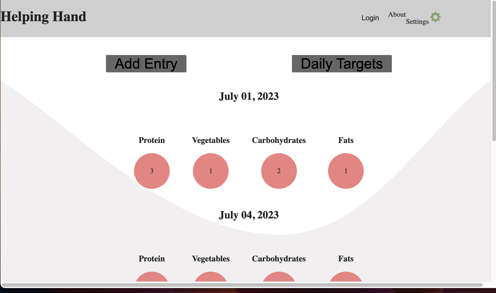

<!-- helping-hand created by
1. Desiree
2. Justin
3. Jeremy
4. Shelby -->

# Helping Hand :wave:

 

A web app created by [Desiree](https://github.com/descush), [Justin](https://github.com/jgreener6), [Jeremy](https://github.com/jlschlossman), and [Shelby]()

Helping Hand is mobile friendly food journaling application written in ReactJS that helps you plan your food portions by using your hand as a guideline.

## Helping Hand App

### Features

- Allows a user to input a food item of their choosing and submit to a list of entries. Users can choose whether the food item is a serving of...

    "Protein"
    
     
    "Carbohydrate"
    

    "Vegetable"
    

    "Fat"
    

- The home page provides a full tally of all the entries made by the user sorted by date and macronutrient type.

- Dark mode provides an accessibility option for those with sensitive eyes.

### Technologies used

Helping Hand is accessed through the use of a web-browser and uses Google Firebase for easy authentication and login. The app is written with JavaScript using the React framework with JSX. Date FNS is used for entry sorting by date. Helping Hand uses the Department of Agriculture's data API to fetch food items and nutritional information for the entry search field.

### Challenges, stretch goals

In the future ...

### How to use

1. After logging in. Use the "Add Entry" button on the homescreen to got to the entry addition page.

2. Select the date for your entry using the calander selector. Then, use the search bar to select a food item. Data is pulled from U.S. Department of agriculture's data API. You can view in-depth nutritional information, if so desired, and can add to a list of entries. Once you have have selected all your entries, click the Submit Entries button.

3. The Home page will show all your entries sorted by date and macronutrient. Don't forget to shoot for your goals! Click the Daily Targets button to show the recommended macronutrient amounts.

4. This app is dark mode enabled! :ghost: Click the settings icon to go to acessability options.